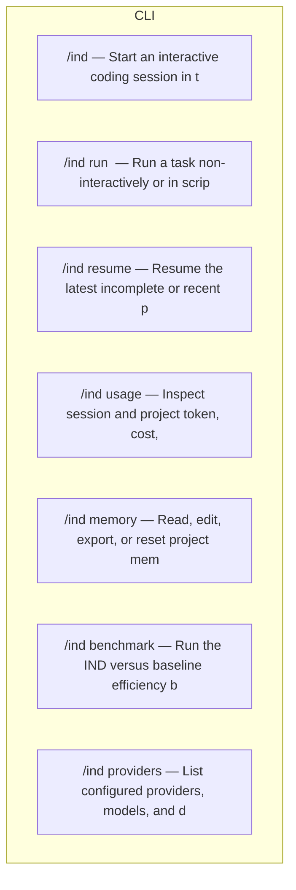

# Sitemap & App Map — IND

> Assembled by `pack-builder.mjs` from `pack-plan.json` · 2026-08-20. **The single source of truth for the whole app** — every route, page, endpoint and workflow. If it's not here, it's not in the MVP.

## 1. Full sitemap (every route in the app)

### 1.1 Visual sitemap (Mermaid — renders on GitHub)



### 1.2 Complete route table (every row IS the app)

| Route           | Page / purpose                                                        | Group | Auth                                                   | Status |
| --------------- | --------------------------------------------------------------------- | ----- | ------------------------------------------------------ | ------ |
| /ind            | Start an interactive coding session in the current project            | CLI   | local credentials and local permissions                | new    |
| /ind run <task> | Run a task non-interactively or in scripted mode                      | CLI   | local credentials and local permissions                | new    |
| /ind resume     | Resume the latest incomplete or recent project session                | CLI   | local credentials and local permissions                | new    |
| /ind usage      | Inspect session and project token, cost, latency, and savings history | CLI   | local project access                                   | new    |
| /ind memory     | Read, edit, export, or reset project memory                           | CLI   | local project access                                   | new    |
| /ind benchmark  | Run the IND versus baseline efficiency benchmark                      | CLI   | local project access and optional provider credentials | new    |
| /ind providers  | List configured providers, models, and detected capabilities          | CLI   | local credentials                                      | new    |

> Rule: the final app MUST contain exactly these routes — nothing more (scope creep), nothing less (missing screens).

---

## 2. Frontend pages — what each page needs

Page map → components uses the locked design system (`design-system.md`) component inventory.

### Interactive session — `/ind`

| Aspect                  | Value                                                                                                                                 |
| ----------------------- | ------------------------------------------------------------------------------------------------------------------------------------- |
| **Purpose**             | Enter a task and execute it through visible chunks.                                                                                   |
| **Layout**              | Full-screen terminal TUI with header, transcript, chunk rail, and usage footer.                                                       |
| **Auth level**          | local                                                                                                                                 |
| **Key components**      | command prompt, task plan, chunk list, diff preview, approval prompt, tool output, token ledger, status bar                           |
| **Data it reads**       | project metadata, memory summary, configured provider/model, current session and usage events                                         |
| **Actions it triggers** | create session, plan task, approve or reject chunk, edit settings, cancel request, continue next chunk                                |
| **States to build**     | first-run setup, provider missing, idle, planning, waiting approval, streaming, tool running, verification, error, canceled, complete |
| **Navigation**          | ind opens a session; resume returns to the latest state; usage and memory are separate commands                                       |

### Usage report — `/ind usage`

| Aspect                  | Value                                                                                     |
| ----------------------- | ----------------------------------------------------------------------------------------- |
| **Purpose**             | Explain where tokens and time were spent and what IND saved.                              |
| **Layout**              | Readable table output with optional compact TUI view.                                     |
| **Auth level**          | local                                                                                     |
| **Key components**      | date/model filters, session table, chunk table, totals, savings comparison, export action |
| **Data it reads**       | SQLite sessions, chunks, and usage events                                                 |
| **Actions it triggers** | filter, compare baseline, export JSONL, reset local metrics                               |
| **States to build**     | no sessions, partial usage, complete report, unavailable cost metadata                    |
| **Navigation**          | from any session with a keyboard shortcut or standalone command                           |

### Project memory — `/ind memory`

| Aspect                  | Value                                                                                          |
| ----------------------- | ---------------------------------------------------------------------------------------------- |
| **Purpose**             | Make persistent context inspectable and maintainable.                                          |
| **Layout**              | Markdown-first output with category summaries and edit commands.                               |
| **Auth level**          | local                                                                                          |
| **Key components**      | memory sections, recent decisions, open questions, file references, edit/export/reset commands |
| **Data it reads**       | MEMORY.md and memory_entries table                                                             |
| **Actions it triggers** | show, add, compact, export, edit, reset                                                        |
| **States to build**     | missing memory, initialized, stale memory, conflict between Markdown and SQLite                |
| **Navigation**          | opened from session or standalone command                                                      |

### Efficiency benchmark — `/ind benchmark`

| Aspect                  | Value                                                                                    |
| ----------------------- | ---------------------------------------------------------------------------------------- |
| **Purpose**             | Measure token savings and completion quality against a baseline.                         |
| **Layout**              | Progressive terminal report with machine-readable JSONL output.                          |
| **Auth level**          | local                                                                                    |
| **Key components**      | fixture selector, provider matrix, baseline toggle, progress, results table, report path |
| **Data it reads**       | fixture repositories, benchmark runs, usage events                                       |
| **Actions it triggers** | run, cancel, compare, export report                                                      |
| **States to build**     | missing provider, fixture failure, running, completed, incomplete                        |
| **Navigation**          | standalone command or post-session suggestion                                            |

---

## 3. Backend architecture (this app's, not generic)

### 3.1 Folder structure (target — Next.js App Router)

```
src/cli, src/core, src/providers, src/context, src/memory, src/usage, src/tools, src/terminal, src/benchmark, src/storage
```

### 3.2 Data model (paste-ready — matches PRD §6)

| Entity         | Key fields                                                                                                                                | Relations                                                                       |
| -------------- | ----------------------------------------------------------------------------------------------------------------------------------------- | ------------------------------------------------------------------------------- |
| projects       | id, root_path, display_name, created_at, updated_at                                                                                       | one project has many sessions and memory entries                                |
| sessions       | id, project_id, provider, model, started_at, ended_at, status, input_tokens, output_tokens, estimated_cost                                | many sessions belong to one project                                             |
| chunks         | id, session_id, sequence, title, goal, status, input_tokens, output_tokens, started_at, completed_at                                      | many chunks belong to one session                                               |
| usage_events   | id, session_id, chunk_id, provider, model, event_type, input_tokens, output_tokens, cached_tokens, latency_ms, estimated_cost, created_at | many usage events belong to a session and optional chunk                        |
| memory_entries | id, project_id, category, key, content, source, importance, created_at, updated_at                                                        | many memory entries belong to one project and mirror selected Markdown sections |

Rules: `user_id` FK on every owned table · `created_at` default now() · indexes on `user_id`, `status`, `email` · every user-scoped query filters by `eq(x.userId, session.user.id)`.

### 3.3 Backend endpoints & server actions (every one the frontend calls)

| Method  | Path / action   | Purpose                                                                 | Auth                | Input (zod)                                         |
| ------- | --------------- | ----------------------------------------------------------------------- | ------------------- | --------------------------------------------------- |
| command | ind             | Start interactive session                                               | local               | task text, optional flags, local config             |
| command | ind run         | Execute one task with chunk controls                                    | local               | task text, provider, model, budget, approval mode   |
| command | ind usage       | Read usage ledger and savings report                                    | local               | date range, project, session, output format         |
| command | ind memory      | Manage project memory                                                   | local               | subcommand, category, content                       |
| command | ind benchmark   | Run fixture benchmark                                                   | local               | fixture set, provider matrix, baseline, output path |
| adapter | ProviderAdapter | Normalize chat, streaming, tools, usage, cancellation, and capabilities | provider credential | messages, tools, model settings, abort signal       |

### 3.4 Auth flow (this app)

1. Load provider credentials from environment or local credential store.
2. Resolve the selected provider and model without printing secrets.
3. Expose only supported capabilities to the agent loop.
4. Record provider and model metadata in the local usage ledger.

### 3.6 Env vars (paste into `.env.example`)

| Var                          | Example                   | Where it comes from                 |
| ---------------------------- | ------------------------- | ----------------------------------- |
| OPENAI_API_KEY               | set in user environment   | OpenAI                              |
| ANTHROPIC_API_KEY            | set in user environment   | Anthropic                           |
| GOOGLE_GENERATIVE_AI_API_KEY | set in user environment   | Google                              |
| IND_BASE_URL                 | http://localhost:11434/v1 | Local or OpenAI-compatible endpoint |
| IND_MODEL                    | local-model               | User configuration                  |

---

## 4. Workflows — how users and the system move through the app

### 4.1 Core user journeys (step-by-step)

**Journey 1 — Task to verified chunk**

1. Read project memory and Git status.
2. Parse the task and generate a bounded plan.
3. Rank relevant files and calculate the context budget.
4. Show the first chunk, expected edits, commands, and estimated usage.
5. Wait for approval according to the configured approval mode.
6. Stream the model response and execute only allowed tools.
7. Show the diff and run verification commands.
8. Record usage and outcome, update memory, and propose the next chunk.

**Journey 2 — Provider selection**

1. Read provider configuration.
2. Detect native and OpenAI-compatible endpoints.
3. Probe capabilities without sending project content.
4. Select a model using explicit configuration or task routing.
5. Fallback to deterministic behavior when the provider is unavailable.

**Journey 3 — Resume session**

1. Locate the project root and session database.
2. Load the latest memory and incomplete chunk.
3. Show changed files and unresolved decisions.
4. Recalculate a small context set rather than replaying the full transcript.
5. Ask for approval before continuing execution.

### 4.2 System workflows (backend, step-by-step)

**Context efficiency**

1. Use Git status and file metadata before reading content.
2. Use an indexed repository map and cached summaries.
3. Select only relevant files and symbols.
4. Truncate command output and deduplicate repeated observations.
5. Compact older session state at a configurable threshold.
6. Record baseline and actual input tokens for every model call.

**Usage ledger**

1. Receive usage events from every adapter call.
2. Normalize token fields and mark estimates when unavailable.
3. Calculate cloud cost from configured price metadata.
4. Separate local compute metrics from monetary cost.
5. Render live totals in the terminal and persist SQLite rows.

**Memory update**

1. Collect changed files, decisions, failures, and next steps.
2. Generate a schema-validated summary when a model is available.
3. Use a deterministic template fallback when it is not.
4. Append portable Markdown and upsert structured entries.
5. Load only relevant memory sections in future sessions.

---

## 5. Definition of done (this file is complete when…)

- [ ] §1.2 route table has every route, no placeholders left
- [ ] §2 has one filled page block per route in §1.2
- [ ] §3 backend matches `PRD.md` §6 data model and `stack-blueprint.md` §4–5
- [ ] §4 covers every PRD must-have flow as a numbered journey/system workflow
- [ ] No route, page, table, endpoint, or step appears in the build order (`stack-blueprint.md` §6 / `TODO.md`) that is missing here
